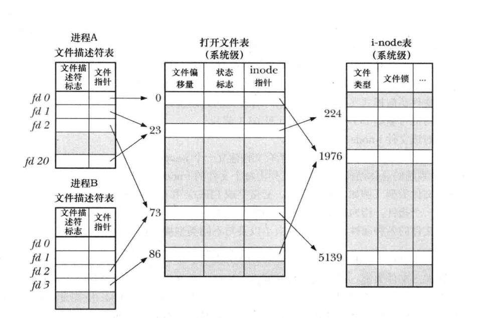

# 文件描述符和打开文件之间的关系

+ 多个文件描述符可以指向同一打开文件
+ 这些文件描述符可在相同或不同的进程中打开
+ 可以查看内核维护的3个数据结构:
	+ 进程及的文件描述符表
	+ 系统级的打开文件表
	+ 文件系统的i-node表
+ 针对每个进程, 内核围棋维护打开文件的描述符表, 该表的没有条记录都记录了单个文件描述符的相关信息:
	+ 控制文件描述符操作的一组标志
	+ 对打开文件句柄的引用
+ 内核对所有打开的文件维护有一个系统级的描述表, 有时, 也称之为打开文件表, 并将表中各条目称之为打开文件句柄, 一个打开文件句柄存储了与一个打开文件相关的全部信息
	+ 当前文件偏移量
	+ 打开文件时所使用的状态标志
	+ 文件访问模式
	+ 与信号驱动 I/O 相关的设置
	+ 对该文件i-node对象的引用
+ 每个文件系统都会为驻留其上的所有文件建立一个i-node表:
	+ 文件类型和访问权限
	+ 一个指针, 指向该文件所持有的锁的列表
	+ 文件的各种属性, 包括文件大小以及与不同类型操作相关的时间戳

+ 在上图中 两个进程拥有诸多打开的文件描述符
+ 在进程A中, 文件描述符1和20都指向同一个打开的文件句柄, 这可能是通过调用dup(), dup2()或fcntl()而形成的
+ 进程A的文件描述符2和进程B的文件描述符2都指向同一个打开的文件句柄, 在这种情形可能是在调用fork()之后出现, 或者当某进程通过UNIX域套接字将一个打开的文件描述符传递给另一个进程时, 也会发生.
+ 进程A的描述符0和进程B的描述符3分别指向不同的打开文件句柄, 但这些句柄均指向i-node表中的相同条目, 换言之, 指向同一文件. 发生这种情况是因为每个进程格子对同一文件发起了open()调用, 同一个进程两次打开同一文件, 也会发生类似情况

### 要点:
+ 两个不同的文件描述符, 若指向同一打开文件句柄, 将共享同一文件偏移量, 因此, 如果通过其中一个文件描述符来修改文件偏移量, 那么从另一文件描述符中也会观察到这一变化, 无论这两个文件描述符分数与不同进程, 还是属于一个进程, 情况都是如此
+ 要获取和修改打开文件的标志, 可移植性fcntl()的F_GETFL和F_SETFL操作, 其对作用于的约束与上一条类似
+ 文件描述符标志为进程和文件描述符所私有, 对这一标志的修改将不会影响同一进程或不同进程中的其他文件描述符