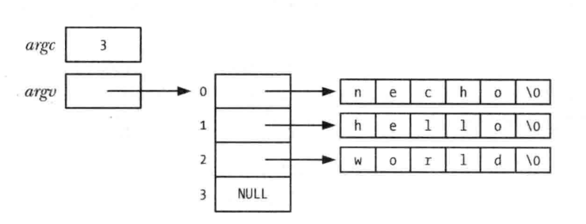

<font size=4 color=#4B2296 face="微软雅黑">

# 命令行参数 (argc, argv)

+ **每个C语言程序都必须有一个main()函数, 作为程序启动的起点**
+ **当执行程序时, 命令行参数通过两个入残提供给main()函数**
+ **第一个参数`int argc`, 表示命令行参数的个数, 第二个参数`char *argv[]`, 是一个指向命令行参数的指针数组, 每一参数又是以空字符结尾的字符串, 第一个字符串, 即argv[0]指向的, 是改程序的名称, argv中的指针列表以NULL指针结尾(即 `argv[argc] == NULL`)**

## argv 指针数组

+ argv[0]包含了调用程序的名称, 可以利用这一特性实现一个使用的小技巧. 首先为同一程序创建多个链接(即名称不同), 然后让该程序查看argv[0], 并根据调用程序的名称来执行不同的任务(gzip(1), gunzip(1) 和 zcat(1)命令, 这些命令链接的都是同一可执行文件
	+ **注意: 使用该技术, 必须小心处理如下情况**
		+ 用户通过链接调用程序, 但链接名有在改程序的意料之外

**下图展示传入参数argc个argv的数据结构, 使用C语言中的'\0'来表示每个字符末尾的终止空字节**



**回显命令行参数**
```c
#include "tlpi_hdr.h"

int main(int argc, char *argv[])
{
	int j;
	for(j = 0; j < argc; j++){
		printf("argv[%d] = %s\n", j, argv[j]);
	}
	exit(EXIT_SUCCESS);
}
```

+ 因为argv列表以NULL值终止, 所以可以将程序主体改写如下, 且每一行只输出一个命令行实参:

```c
char **p;
for(p = argv; *p != NULL; p++){
	puts(*p);
}
```

+ argc/argv参数机制的局限之一在于这些变量仅对main()函数可用, 在保证可移植性的同时, 为了是这些命令航参数能为其他函数所用, 必须吧argv以参数形式传递给这些函数, 或是设置一个指向argv的全局变量
+ 想要从程序内任一位置访问这些信息的部分或者全部内容, 还有两种方法, 但是会破坏程序的可移植性:
	+ 通过Linux系统转悠的/proc/PID/cmdline文件可以读取任一进程的命令行参数, 每个参数都以MULL字节终止(程序可以通过/proc/self/cmdline 文件访问自己的命令行参数)
	+ GNU C 语言库提供有两个全局变量, 可在程序内任一位置使用一获取调用改程序时的程序名称(即命令行的第一个参数, 第一个全局变量 program_invocation_name, 提供了用于调用改程序的完整路径名. 第二个全局变量program_invocation_short_name, 提供了不含目录的程序名称, 即路径名的基本名称部分, 定义_GNU_SOURCE宏后即可从<error.h>中获得对这两个全局变量的声明
+ argv和environ数组, 以及这些参数最初指向的字符串, 都驻留在进程战之殇的一个单一, 连续的内存区域, 此区域可存储的字节数有上限要求, SUSv3规定使用ARG_MAX常量(<limit.h>)或者调用sysconf(_SC_ARG_MAX)函数一确定该上限值, 并且SUSv3还要求ARG_MAX常量的额下限为_POSIX_AG_MAX(4096)个字节, 而大多数UNIX实现的限制都远高于此, 但SUSv3并未规定对ARG_MAX限制的实现中是否要将一些开销字节计算在内(比如终止空字符, 字节对齐, argv和environ指针数组)
+ 许多程序使用getopt()库函数解析命令行选项(即以'-'符号开头的参数)