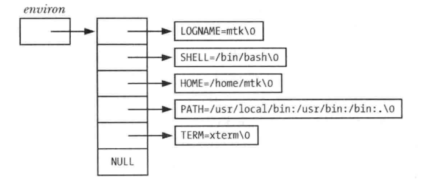

<font size=4 color=#4B2296 face="微软雅黑">

# 环境列表

## 定义

+ 每一个进程都有与其相关的称之为环境列表的字符串数组, 或简称为环境
+ 其中每个字符串都已名称=值形式定义
+ 环境是"名称-值"的成对集合, 可存储任何信息, 常将列表中的名称称之为环境变量
+ 新进程在创建时, 会继承其父进程的环境副本, 这是一种原始的进程间通信方式, 比较常用
+ 环境提供了将信息从父进程传递给子进程的方法. 由于子进程只有在创建时才能获得其父进程的环境副本, 所以这一信息传递是单向的, 一次性的. 子进程创建后, 父子进程均可更改格子的环境变量, 且这些变更对对方而言不再可见
+ 环境变量的常见用途之一是在shell中, 通过在自身环境中放置环境变量, shell就可确保把这些值传递给其所创建的进程, 并以此来执行用户命令
+ 可以通过设置环境变量法来改变一些库函数的行为, 用户无需修改程序代码或者冲新连接相关库, 就能控制调用该函数的应用程序行为.
+ getopt()函数就是其中一例, 可通过设置POSIXLY_CORRECT环境变量来改变此函数的行为

大多数shell使用export命令向环境中添加变量值:
		
	$ SHELL=/bin/bash
	$ export SHELL

在bash shell和Korn shell 中 可以简写为:
	
	$ eport SHELL=/bin/bash

在C shell中, 使用的则是setenv命令:
	
	$ setenv SHELL /bin/bash

+ 上述命令吧一个值永久的添加到shell环境中, 此后这个shell创建的所有子进程都将继承此环境
+ 在任一时刻, 可以使用unset命令撤销一个环境变量(C shell 中则使用unsetenv命令)
+ 在Bourne shell 和其衍生shell(如 bash shell 和 Korn shell)中, 可使用下列语法执行某应用程序的环境中添加一个变量值, 而不影响其父shell:
	+ $ NAME=value program
+ 此命令仅向执行特定程序的子进程环境添加一个定义, 如果希望, 可以在program前放置多对赋值
+ printenv命令显示当前的环境列表
+ 环境列表的排列是无序的
+ 通过Linux专有的/proc/PID/environ文件检查任一进程的环境列表, 每一个键值对都以空字节终止

## 从程序中访问环境

+ 在C语言程序中, 可以使用全局变量`char **environ`访问环境列表
+ environ与argv参数类似, 指向一个与NULL结尾的指针列表, 每个指针又指向一个以空字节终止的字符串

**与上述printenv命令输出环境相对应的环境列表数据结构**



**显示进程环境**

```c
#include "tlpi_hdr.h"

extern char **environ

int main(int argc, char *argv[])
{
	char **ep;
	for(ep = environ; *ep != NULL; ep++){
		puts(*ep);
	}
	exit(EXIT_SUCCESS);
}
```
+ 上述程序通过访问environ变量来展示该进程环境中的所有值
+ 改程序输出结果与printenv命令的输出结果相同, 程序中的循环利用指针来遍历environ变量
+ 虽然可以把environ当成数组来使用, 但这多少有些生硬, 因为环境列表中各项的排列不分先后, 而且也没有变量用来指定环境类表的长度
+ 另外, 还可以通过声明main()函数中的第三个参数来访问环境列表

```c
int main(int argc, char *argv[], char *envp[])
```
+ 该参数随即可被视为environ变量来使用, 所不同的是, 该参数的作用于在main()函数内, 虽然UNIX系统普遍实现了这一特性, 但还是要避免使用, 因为除了局限于作用于限制外, 该特性也不再SUSv3的规范之列

getenv()函数能够从进程环境中检索单个值:

```c
#include <stdlib.h>

char *getenv(const char *name);

Returns pointer to value string, or NULL if no such variable
```

+ 向getenv()函数提供环境变量名称, 还函数将返回相应字符串指针
+ 前面所示的环境实例来看, 如果指定SHELL为参数name, 那么将返回/bin/bash. 
+ 如果不存在指定名称的环境变量, 那么getenv()函数将返回NULL
+ 以下是使用getenv()函数时可移植性方面的注意事项:
	+ SUSv3规定应用程序不应修改getenv()函数返回的字符串, 这是由于该字符串实际上属于环境的一部分, 若需要改变一个环境变量的值, 可以使用setenv()函数或putenv()函数
	+ SUSv3允许getenv()函数的实现使用静态分配的缓冲区返回执行结果, 后续对getenv(), setenv(), putenv()或者unsetenv()的函数调用可以重写该缓冲区, 虽然glibc库的getenv()函数实现并未这样使用静态缓冲区, 但具备可移植性的程序如需保留getenv()调用返回的字符串, 就应该先将返回字符串赋值到其他位置, 之后方可对上述函数发起调用

## 修改环境

+ 修改环境对进程的用处:
	+ 这一修改对该进程后续创建的所有子进程均可见
	+ 设定某一变量, 以求对于将要载入进程内存的新程序可见
+ 环境不仅是一种进程间通信的形式, 还是程序间通信的方法

---

+ putenv()函数向调用进程的环境中添加一个新变量, 或者修改一个已经存在的变量值

```c
#include <stdlib.h>

int putenv(char *string);

Returns 0 on success, or nunzero on error
```

+ 参数string是一个指针, 指向name=value形式的字符串
+ 调用putenv()函数后, 该字符串就成为环境的一部分, 换言之, putenv函数将设置environ变量中某一元素的还想与string参数的指向位置相同, 而非string参数所需之乡字符串的复制副本
+ 如果随后修改string参数所指向的内容, 浙江影响该进程的环境
+ string参数不应为自动变量, 因为定义此变量的函数一旦返回, 就有可能会重写这块内存区域
+ **注意:** putenv()函数调用失败返回非0值, 而非-1
+ putenv()函数的glibc库实现还提供了一个非标准扩展, 如果string参数内容不包括一个等号'=', 那么将从环境列表中移除一string参数命名的环境变量

---

+ setenv()函数可以替代putenv()函数,向环境中添加一个变量

```c
include <stdlib.h>

int setenv(const char *name, const char *value, int orerwrite);

Returns 0 on success, or -1 on error
```

+ setenv()函数为形如name=value的字符串分配一块内存缓冲区, 并将name和value所指向的字符串赋值到次缓冲区, 为此来穿件一个新的环境变量
+ **注意: ** 不需要再name的结尾处或者value的开始出提供一个等号字符, 因为setenv()函数会在向环境添加新变量是添加等号字符
+ 若以name标识的变量在环境中已经存在, 且参数overwrite的值为0, 则setenv()函数将不改变环境, 如果参数overwrite的值为非0, 则setenv()函数总是改变环境
+ setenv()函数复制其参数意味着与putenv()函数不同, 之后对name和value所知字符串内容的修改将不会影响环境, 使用自动变量作为setenv()函数的参数也没有问题

---

+ unsetenv()函数从环境中移除有name参数标识的变量

```c
#include <stdlib.h>

int unsetenv(const char *name);

Returns 0 on success, or -1 on error
```

+ 同setenv()函数一样, 参数name不应包含等号字符
+ setenv()函数和unsetenv()函数均来自BSD, 不如putenv()函数使用普遍
+ 有时, 需要清除整个环境, 然后以所选值进行重建
+ 可以通过将environ变量赋值为NULL来清除环境
		environ = NULL;
+ 也可以调用clearenv()库函数:

```c
#defind _BSD_SOURCE
#include <stdlib.h>

int clearenv(void)

Returns 0 on success, or a nonzero on error
```

+ 在某些情况下, 使用setenv()函数和getenv()函数可能会导致程序内存泄露, setenv()函数所分配的一块内存缓冲区, 随之会成为进程环境的一部分, 而调用clearenv()是则没有释放该缓冲区, 反复调用这两个函数的程序, 会不断产生内存泄露
+ 但是, 这不大可能成为一个问题, 因为程序通常尽在启动时调用chearenv()函数一次, 用于移除继承自其父进程环境中的所有条目

## 程序示例

**修改进程环境 : **
```c
#define _GNU_SOURCE
#include <stdlib.h>
#include "tlpi_hdr.h"

extern char **environ;

int main(int argc, char *argv[])
{
	int j;
	char **ep;
	clearenv();
	for(j = 1; j < argc; j++){
		if(putenv(argv[j]) != 0)
			errExit("putenv: %s", argv[j]);
	}

	if(setenv("GREET", "Hello world", 0) == -1)
		errExit("setenv");

	unsetenv("BYE");

	for(ep = environ; *ep != NULL; ep++)
		puts(*ep);

	exit(EXIT_SUCCESS);
}
```

+ 程序展示了上述所有函数的用法
+ 该程序首先清空环境, 然后向环境中逐一添加命令行参数所提供的环境变量定义; 之后, 如果环境中上午名为GREET的变量, 就向环境中添加该变量; 接着, 从环境中移除名为BYE的变量, 最后打印当前环境列表
+ 如果将environ参数赋值为NULL, 那么可以预见如下形式的循环将失败, 因为*environ是无效的

```c
for(ep = environ; *ep != NULL; ep++)
	puts(*ep);
```

+ 如果setenv()函数和putenv()函数发现environ参数为NULL, 则会创建一个新的环境列表, 并使environ参数指向此列表, 结果上面的循环操作又将正确运行
