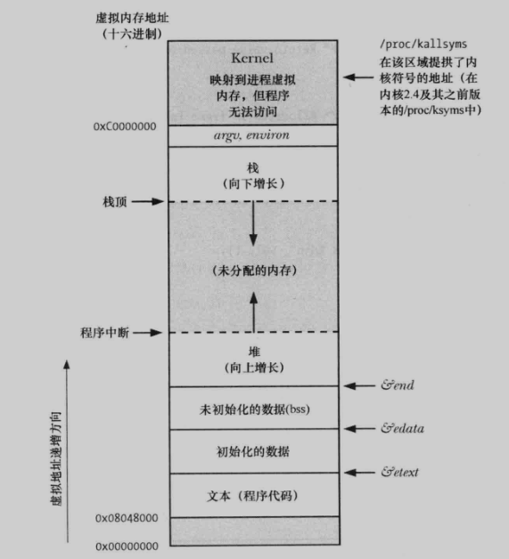

<font size=4 color=#264246 face="微软雅黑">

# 在堆上分配内存
---
**进程可以通过增加堆的大小来分配内存**

## 堆
+ 是一段长度可变的连续细腻内存, 始于进程的未初始化数据段末尾, 随着内存的分配和释放而增减
+ 通常将对的当前内存边界称为 "program break"

## 调整program break : brk()和sbrk()

+ 改变堆的大小(即分配或释放内存), 最初, program break的位置位于未初始化数据段末尾, 如图:


+ 在program break的位置抬升后, 程序可以访问新分配区域内的任何内存地址, 而此时屋里内存页还没有分配
+ 内核会在进程首次试图访问这些虚拟内存地址时自动分配新的物理内存页
+ 两个操作program break的系统调用: brk()和sbrk():

```c
#include <unistd.h>

int brk(void * end_data_segment);

Returns 0 on success, or -1 on error

void *sbrk(intptr_t increment);

Returns previous program break on success, or (void *)-1 on error

```

## 在堆上分配内存: malloc()和free()

## malloc()和free()的实现

## 在堆上分配内存的其他方法